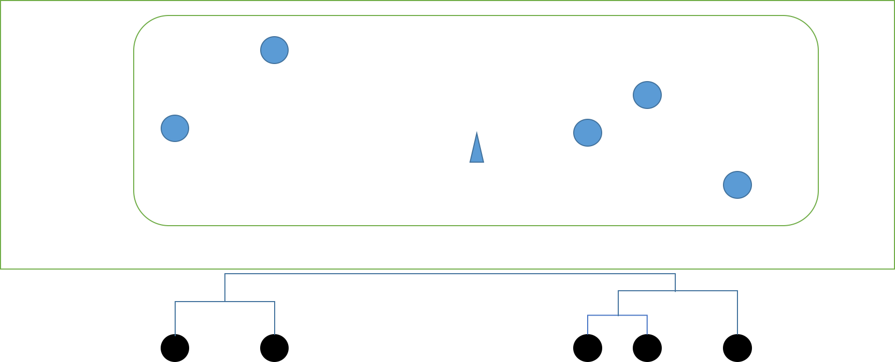

# 階層型クラスタリング(HierarchicalClustering)
## 階層型クラスタリングとは？
各データを1つのクラスタとして、類似度や距離に基づき逐次的にクラスタを併合していく手法

## 階層型クラスタリング アルゴリズム

* 全てのベクトルが1つずつのクラスタとする

* 全てのクラスタの中で一番距離が近いクラスタ同士を結合して1つのクラスタとする。

* 全てのクラスタの中で一番距離が近いクラスタ同士を結合して1つのクラスタとする。

* 全てのクラスタの中で一番距離が近いクラスタ同士を結合して1つのクラスタとする。

* 全てのクラスタの中で一番距離が近いクラスタ同士を結合して1つのクラスタとする。
* クラスタ数が1つになったので終了。
* 完成した **樹形図(dendrogram)** をある高さで切るとk個のクラスタが得られる。

## 参考資料
* http://www.kamishima.net/archive/clustering.pdf
