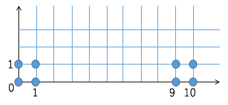
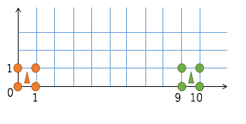
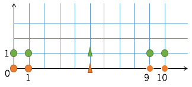

# k-means
## 1. Introduction
### 1.1 クラスタリングとは?
* クラスタリング(clustering)
  - データの集合を”似たもの同士”でグループ化する作業。
* クラスタ(cluster)
  - クラスタリングの結果できあがったグループ。
* 教師なしなので、あらかじめどんなクラスタにクラスタリングされるかはわからない。(こういった規則でわけたいと予め意図があってグループ化するものは"分類"という。clustering≠分類)


### 1.2 k-meansとは?
* ベクトルをk個のクラスタにクラスタリングする手法


## 2. アルゴリズム
### 2.1 k-meansアルゴリズム
0. 各ベクトルの所属クラスタを乱数で選ぶ。
1. 各クラスタに所属するベクトルの重心をとり、クラスタの重心ベクトルとする。
2. 各ベクトルから一番近いクラスタの重心ベクトルを新たな所属クラスタとする。
3.	所属クラスタが更新されていればStep1へ、更新されていなければ終了


## 3. k-means++法
### 3.1 初期点に対する問題


上の図ようなベクトル群をk=2でクラスタリングしたいとする。



理想的にはこのようにクラスタリングされて欲しいという願望がある。



しかし、初期点の取り方によってはこの図のようにクラスタリングされてしまうことがある。

実際にプログラムによって何回か実行すると以下の2パターンのクラスタリングパターンになる。

[pattern1]
```
// クラスタ番号: vectorの要素
0:   0   0
0:   0   1
0:   1   0
0:   1   1
1:   9   0
1:   9   1
1:  10   0
1:  10   1

// クラスタ番号: 重心ベクトル
 0   0.5   0.5
 1   9.5   0.5
```

[pattern2]
```
// クラスタ番号: vectorの要素
1:   0   0
0:   0   1
1:   1   0
0:   1   1
1:   9   0
0:   9   1
1:  10   0
0:  10   1

// クラスタ番号: 重心ベクトル
 0   5.0   1.0
 1   5.0   0.0
```

この問題に対応する初期点の取り方のアルゴリズムがk-means++法である。

### 3.2 k-means++法

```
2:  80  85 100
2:  96 100 100
0:  54  83  98
2:  80  98  98
2:  90  92  91
1:  84  78  82
2:  79 100  96
2:  88  92  92
1:  98  73  72
2:  75  84  85
2:  92 100  96
2:  96  92  90
1:  99  76  91
2:  75  82  88
2:  90  94  94
0:  54  84  87
1:  92  89  62
2:  88  94  97
0:  42  99  80
0:  70  98  70
1:  94  78  83
0:  52  73  87
1:  94  88  72
1:  70  73  80
2:  95  84  90
2:  95  88  84
2:  75  97  89
0:  49  81  86
1:  83  72  80
1:  75  73  88
1:  79  82  76
1: 100  77  89
1:  88  63  79
1: 100  50  86
0:  55  96  84
1:  92  74  77
1:  97  50  73


 0  53.7  87.7  84.6
 1  89.7  73.1  79.3
 2  86.3  92.1  92.7
 ```

## 4. ソースコード
* [KMeans.java](../../src/clustering/KMeans.java)
* [KMeansMain.java](../../src/clustering/KMeansMain.java)

## 5. javadoc
[javadoc](https://htmlpreview.github.io/?https://raw.githubusercontent.com/otamot/MachineLearning/master/doc/clustering/KMeans.html)
html形式のjavadoc。クラスや、メソッドの詳細な説明を記述。
