# k-means
## 1. Introduction
### 1.1 クラスタリングとは?
* クラスタリング(clustering)
  - データの集合を”似たもの同士”でグループ化する作業。
* クラスタ(cluster)
  - クラスタリングの結果できあがったグループ。
* 教師なしなので、あらかじめどんなクラスタにクラスタリングされるかはわからない。(こういった規則でわけたいと予め意図があってグループ化するものは"分類"という。clustering≠分類)


### 1.2 k-meansとは?
* ベクトルをk個のクラスタにクラスタリングする手法


## 2. アルゴリズム
### 2.1 k-meansアルゴリズム
```
Step0: 各ベクトルの所属クラスタを乱数で選ぶ。
Step1: 各クラスタに所属するベクトルの重心をとり、クラスタの重心ベクトルとする。
Steo2: 各ベクトルから一番近いクラスタの重心ベクトルを新たな所属クラスタとする。
Step3: 	所属クラスタが更新されていればStep1へ、更新されていなければ終了
```


## 3. k-meansの初期値選択
### 3.1 初期点に対する問題
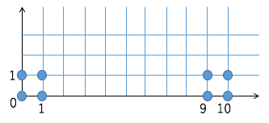

上の図ようなベクトル群をk=2でクラスタリングしたいとする。

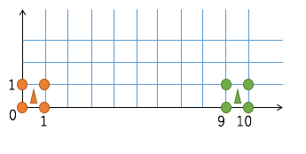

理想的にはこのようにクラスタリングされて欲しいという願望がある。

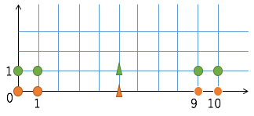

しかし、初期点の取り方によってはこの図のようにクラスタリングされてしまうことがある。

実際にプログラムによって何回か実行すると以下の2パターンのクラスタリングパターンになる。

[pattern1]
```
// クラスタ番号: vectorの要素
0:   0   0
0:   0   1
0:   1   0
0:   1   1
1:   9   0
1:   9   1
1:  10   0
1:  10   1

// クラスタ番号: 重心ベクトル
 0   0.5   0.5
 1   9.5   0.5
```

[pattern2]
```
// クラスタ番号: vectorの要素
1:   0   0
0:   0   1
1:   1   0
0:   1   1
1:   9   0
0:   9   1
1:  10   0
0:  10   1

// クラスタ番号: 重心ベクトル
 0   5.0   1.0
 1   5.0   0.0
```


### 3.2 KKZ法
* このような初期値ランダム問題に対処するために考案された1つ目の手法。
* 後で紹介するk-means++法の先行研究。


#### 3.2.1 KKZ法アルゴリズム
```
Step0:ランダムに1つベクトルを選び代表ベクトルとする
Step1:代表ベクトルの数がk個になったら終了
Step2:それぞれのベクトル𝑥に関して、最も近い代表ベクト		ルの距離を求める。
Step3:Step2で求めた距離が最大になるベクトルを新たな代		表ベクトルとして選択
```

#### 3.2.2 KKZ法 例
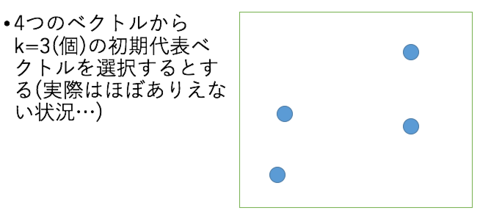
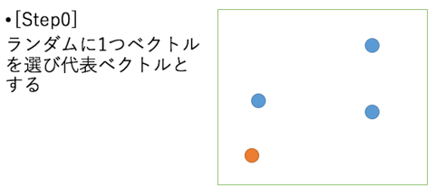
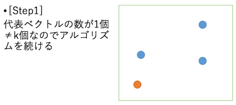
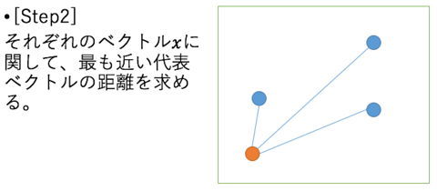
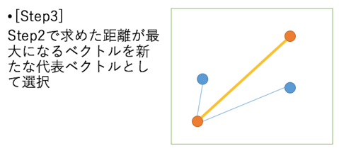
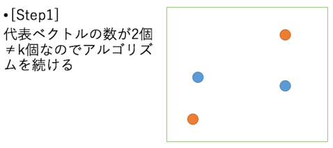
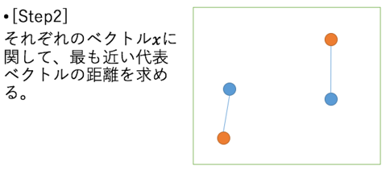
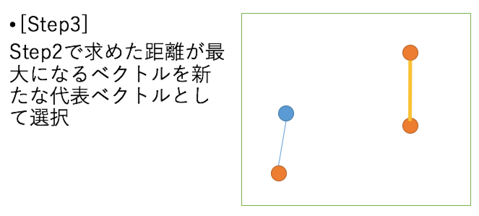
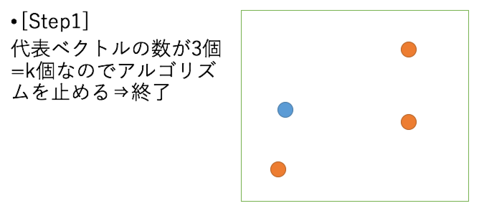

#### 3.2.3 KKZ法の問題点
KKZはなるべく選んだ点から遠い点を選ぶというアルゴリズムである。
そのため、外れ値があると必ず外れ値を選んでしまう。
この問題も考慮した初期値選択アルゴリズムが次のk-means++法である。

### 3.3 k-means++法
kkzでは距離が最大になるように点を選んでいたが、k-means++では距離が遠いものが選ばれやすく、近いものが選ばれにくいような重み付き確率分布によってランダムにつぎの点を決める。


#### 3.3.1 k-means++法アルゴリズム
```
Step0:ランダムに1つベクトルを選び代表ベクトルとする
Step1:代表ベクトルの数がk個になったら終了
Step2:それぞれのベクトル𝑥に関して、そのベクトルに一番近い代表ベクトルとの距離𝐷(𝑋)を求める。
Step3:各ベクトルxに関して重み付き確率分布𝜙(x_𝑖)=𝐷(x_𝑖)/∑_𝑘𝐷(𝑥_𝑘)を用いて新たな代表ベクトルをランダムに選ぶ

```

#### 3.3.2 k-meansの有効性
k-means++を使うことによって、初期値選択には時間がかかるが、その後の収束スピードがおよそ2倍、データセットによっては誤差が1000分の1まで減り、一連のデータセットでは誤差が減っている。


#### 3.3.3 さらなるk-meansの問題点
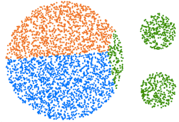

[石井 健一郎, 上田 修功, 前田 英作, 村瀬 洋: わかりやすいパターン認識, オーム社 (1998)](http://shop.ohmsha.co.jp/shop/shopbrand.html?search=4-274-13149-1)


このような図のサイズの異なる集合が3つ存在するとき、k-meansではうまく3つにクラスタリングできない。


## 4. ソースコード
* [KMeans.java](../../src/clustering/KMeans.java)
* [KMeansMain.java](../../src/clustering/KMeansMain.java)

## 5. javadoc
[javadoc](https://htmlpreview.github.io/?https://raw.githubusercontent.com/otamot/MachineLearning/master/doc/clustering/KMeans.html)
html形式のjavadoc。クラスや、メソッドの詳細な説明を記述。


## 参考
* [k-means++法 - Wikipedia](https://ja.wikipedia.org/wiki/K-means%2B%2B%E6%B3%95)
* [k-means++｜ぽんのブログ - アメーバブログ](http://ameblo.jp/p630/entry-10923640201.html)
* [クラスタリングの定番アルゴリズム「K-means法」をビジュアライズしてみた](http://tech.nitoyon.com/ja/blog/2009/04/09/kmeans-visualise/)
* [scikit-learn による最も基本的なクラスタリング分析 - Qiita](http://qiita.com/ynakayama/items/1223b6844a1a044e2e3b)
* [言語処理のための機械学習入門 (自然言語処理シリーズ)](https://www.amazon.co.jp/%E8%A8%80%E8%AA%9E%E5%87%A6%E7%90%86%E3%81%AE%E3%81%9F%E3%82%81%E3%81%AE%E6%A9%9F%E6%A2%B0%E5%AD%A6%E7%BF%92%E5%85%A5%E9%96%80-%E8%87%AA%E7%84%B6%E8%A8%80%E8%AA%9E%E5%87%A6%E7%90%86%E3%82%B7%E3%83%AA%E3%83%BC%E3%82%BA-%E9%AB%98%E6%9D%91-%E5%A4%A7%E4%B9%9F/dp/4339027510)
* [クラスタリング (クラスター分析)](http://www.kamishima.net/jp/clustering/)
