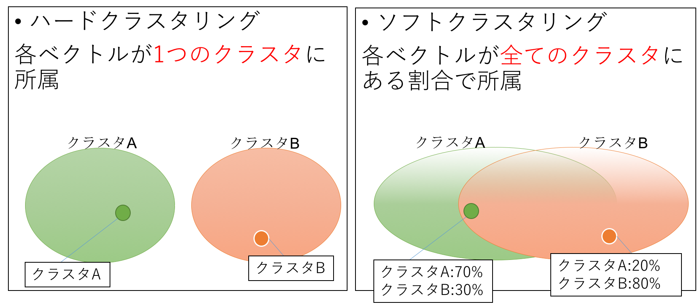

# Clustering
* [資料](http://www.slideshare.net/tomo_otamot/kmeansk)

## Javadoc
[コチラ](https://htmlpreview.github.io/?https://raw.githubusercontent.com/otamot/MachineLearning/master/doc/clustering/package-summary.html)

## 手法一覧

|手法|階層型or非階層型|ハードorソフト|
|:---|:------------|:-----------|
|単連結法|階層型|ハード|
|完全連結法|階層型|ハード|
|群平均法|階層型|ハード|
|ウォード法|階層型|ハード|
|重心法|階層型|ハード|
|メディアン法|階層型|ハード|
|[k-means](KMeans/README.md)|非階層型|ハード|
|x-means|非階層型|ハード|
|スペクトラルクラスタリング|非階層型|ハード|
|Fuzzy c-means|非階層型|ソフト|
|混合分布モデル|非階層型|ソフト|
|pLSI|非階層型|ソフト|
|NMF|非階層型|ソフト|

## 階層型 or 非階層型
### [階層型クラスタリング](./HierarchicalClustering)

## ソフトorハード
### ハードクラスタリング
データがあるクラスタ1つに属するという形で出力されるクラスタリング手法

### ソフトクラスタリング
データが複数のクラスタに属し、各クラスタへの帰属度が出力されるクラスタリング手法

#### 例

